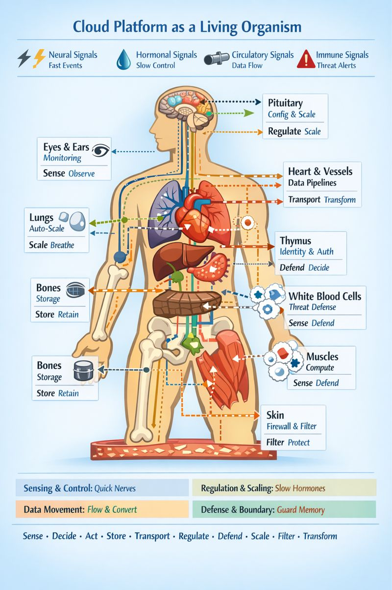
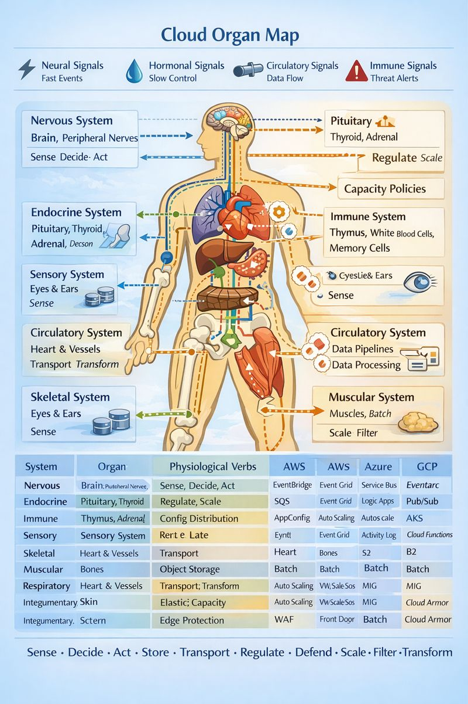

# Designing the Ideal Cloud: Lessons from the Human Body

## Introduction

Modern cloud platforms are immensely powerful but inherently fragmented. Engineers face service sprawl, inconsistent scaling, and opaque interdependencies. Observability, security, and predictability are persistent challenges.

What if we designed the **ideal cloud platform as a living, intelligent organism**—an ecosystem of organs, signals, and reflexive intelligence, modeled after the human body?

This article explores a cohesive framework for architecting a cloud platform that is **resilient, adaptable, self-regulating, and cognitively aware**, drawing on anatomy, physiology, and biochemistry.

---

## 1. The Human-Cloud Analogy

Human bodies provide an intuitive blueprint for designing complex systems. Every organ has a role, every signal has a purpose, and every reflex preserves homeostasis. By mapping cloud components to **body systems**, we can create a platform that is **modular, resilient, and intelligent**.

| Body System        | Cloud Analogy                       | Function                        |
|-------------------|------------------------------------|--------------------------------|
| Nervous System     | Event-driven compute & orchestration    | Fast, directed responses       |
| Endocrine System   | Global config & scaling                 | Slow, systemic regulation      |
| Immune System      | Security & compliance                   | Detection, defense, memory     |
| Circulatory System | Data pipelines & transformation         | Transport & enrichment of data |
| Skeletal System    | Object/file storage                      | Durable structure              |
| Muscular System    | Batch compute                            | Work execution                 |
| Sensory System     | Observability (logs, metrics, alerts)   | Accurate perception & feedback |
| Respiratory System | Elastic scaling                          | Capacity modulation             |
| Integumentary System| Edge protection & boundary enforcement  | Filtering & defense            |

**Figure 1:** 
> A visual diagram illustrating body systems mapped to cloud services, including signals and physiological verbs.

---

## 2. Signals: The Chemical Layer of the Cloud

Signals are the **messaging and control chemistry** that keeps systems coordinated.

| Signal Type   | Biological Analogy         | Cloud Analogy                         | Usage                                              |
|---------------|---------------------------|--------------------------------------|--------------------------------------------------|
| Neural        | Nerve impulses            | Events, triggers                      | Low-latency, ephemeral, event-driven actions   |
| Hormonal      | Hormones                  | Configuration, quotas, scaling        | Slow, persistent, systemic regulation          |
| Circulatory   | Blood                     | Data pipelines, replication           | High-volume transport & transformation         |
| Immune        | Cytokines                 | Security alerts, compliance signals   | Detect threats, escalate, enforce policies     |

**Key insight:** Architectural failures often arise not from the wrong service, but the **wrong signal type**.

---

## 3. Cloud Physiology: Responsibilities Across Systems

Rather than thinking in terms of services, think in **physiological verbs**:

- **Sense** — Observe state or change  
- **Decide** — Evaluate conditions  
- **Act** — Execute work  
- **Store** — Retain durable state  
- **Transport** — Move signals or data  
- **Regulate** — Apply slow, systemic control  
- **Defend** — Detect and respond to threats  
- **Scale** — Adjust capacity  
- **Filter** — Enforce boundaries  
- **Transform** — Convert or enrich data  

Every system in the cloud should focus on a **subset of these verbs**, avoiding category errors that lead to fragility.

---

## 4. Applying Biology to Solve Cloud Challenges

### 4.1 Fragmentation and Complexity
- **Problem:** Service sprawl and inconsistent integration patterns.  
- **Solution:** Assign clear physiological roles and standard signal interfaces.  
- **Benefit:** Cohesive, modular architecture with predictable behavior.

### 4.2 Scaling Limitations
- **Problem:** Reactive scaling is often coarse-grained.  
- **Solution:** Endocrine-inspired hormonal signals, integrated with a cognitive “prefrontal cortex” to anticipate demand.  
- **Benefit:** Smooth, proactive elasticity.

### 4.3 Observability Blind Spots
- **Problem:** Limited visibility reduces operational intelligence.  
- **Solution:** A sensory system of logs, metrics, and alerts using neural signals. Reflex arcs automate responses.  
- **Benefit:** Faster detection and resolution of anomalies.

### 4.4 Security & Compliance
- **Problem:** Security is often bolted on or inconsistent.  
- **Solution:** Immune system as a first-class layer: Identity, threat detection, memory, and automated defense.  
- **Benefit:** Systemic, proactive security.

### 4.5 Data Silos
- **Problem:** Scattered, ungoverned data pipelines.  
- **Solution:** Circulatory system for transport; liver modules for governance and transformation.  
- **Benefit:** Unified, high-integrity data flow with lineage and quality.

### 4.6 Vendor Lock-In
- **Problem:** Proprietary APIs and service models hinder flexibility.  
- **Solution:** Standardized physiological verbs and signal types provide behavior contracts, not vendor-specific implementations.  
- **Benefit:** Multi-cloud portability, hybrid deployments, and faster experimentation.

### 4.7 Operational Predictability
- **Problem:** Complex interactions are difficult to predict.  
- **Solution:** Integrated cognition layer models system-wide effects and coordinates workflows.  
- **Benefit:** Safe evolution, predictable outcomes.

---

## 5. Building the Ideal Cloud: Strategy

### Step 1: Modular Core
- CNS + Circulatory + Skeletal + Muscular modules.  
- Reflex loops for automated responses.

### Step 2: Cognitive Layer
- ML modules for prediction.  
- Orchestration for multi-system workflows.

### Step 3: Immune Layer
- Security and compliance embedded at all levels.  
- Audit memory and automated responses.

### Step 4: Sensory Layer
- Observability and metrics everywhere.  
- Reflex arcs link events to actions.

### Step 5: Iterative Growth
- Start lean, scale organs and systems.  
- Maintain standard signals and verbs to avoid category errors.

**Figure 2:** 
> Diagram showing reflex arcs, hormonal regulation, and predictive cognitive loops coordinating across the platform.

---

## 6. The Cognitive Cloud

A human-body-inspired cloud is not just modular—it’s intelligent:

- Reflexive intelligence (real-time event reactions)  
- Predictive intelligence (forecasting and anomaly detection)  
- Adaptive memory (audit trails and operational baselines)  
- Orchestrated decision-making (workflow coordination)  

> Like a brain coordinating organ systems, the cognitive layer ensures the platform **learns, adapts, and scales safely**.

---

## 7. Visual Blueprint

**Figure 3:**   

This diagram serves as both a **mental model** and a **design guide**.

---

## 8. Appendices

### Appendix A — Master Physiology Vocabulary

| Verb       | Meaning                             |
|-----------|------------------------------------|
| Sense     | Observe state or change            |
| Decide    | Evaluate conditions                |
| Act       | Execute work                       |
| Store     | Retain durable state               |
| Transport | Move signals or data               |
| Regulate  | Apply slow systemic control        |
| Defend    | Detect and respond to threats      |
| Scale     | Adjust capacity                    |
| Filter    | Enforce boundaries                 |
| Transform | Convert or enrich data             |

### Appendix B — Nervous System

| Component        | Physiology | Signal Type | Cloud Responsibility | AWS        | Azure      | GCP              |
|-----------------|------------|-------------|-------------------|-----------|-----------|----------------|
| Thalamus        | Transport  | Neural      | Event routing      | EventBridge | Event Grid | Eventarc        |
| Peripheral Nerves| Transport | Neural      | Reliable messaging | SQS       | Service Bus| Pub/Sub         |
| Reflex Arcs     | Act        | Neural      | Event-driven compute | Lambda    | Functions | Cloud Functions |
| Prefrontal Cortex| Decide    | Neural      | Workflow orchestration | Step Functions | Logic Apps | Workflows     |
| Cerebral Cortex | Act        | Neural      | Long-running logic | ECS/EKS   | AKS       | GKE             |

### Appendix C — Endocrine System

| Component | Physiology | Signal Type | Cloud Responsibility | AWS        | Azure      | GCP         |
|----------|------------|-------------|-------------------|-----------|-----------|------------|
| Pituitary| Regulate   | Hormonal    | Config distribution | AppConfig | App Config| Runtime Config |
| Thyroid  | Regulate   | Hormonal    | Performance tuning | Auto Scaling | Autoscale | Autoscaler |
| Adrenal  | Regulate   | Hormonal    | Burst control      | Lambda limits | Function limits | Quotas |

### Appendix D — Immune System

| Component        | Physiology | Signal Type | Cloud Responsibility | AWS          | Azure       | GCP          |
|-----------------|------------|-------------|-------------------|-------------|------------|-------------|
| Thymus           | Decide     | Immune      | Identity & auth    | IAM         | Entra ID   | IAM          |
| White Blood Cells| Sense      | Immune      | Threat detection   | GuardDuty   | Defender   | SCC          |
| Memory Cells     | Store      | Immune      | Audit & baselines  | CloudTrail  | Activity Log| Audit Logs   |

### Appendix E — Circulatory & Digestive Systems

| Component       | Physiology | Signal Type  | Cloud Responsibility | AWS        | Azure      | GCP        |
|----------------|------------|--------------|-------------------|-----------|-----------|-----------|
| Blood Vessels   | Transport  | Circulatory  | Data pipelines      | Glue      | Data Factory | Data Fusion |
| Liver           | Transform  | Circulatory  | Governance & cleanup| Lake Formation | Purview  | Dataplex  |

### Appendix F — Skeletal & Muscular Systems

| Component | Physiology | Signal Type | Cloud Responsibility | AWS       | Azure       | GCP           |
|----------|------------|-------------|-------------------|-----------|------------|---------------|
| Skeleton | Store      | Structural  | Object storage      | S3        | Blob Storage| Cloud Storage |
| Muscles  | Act        | Neural      | Batch compute       | Batch     | Batch       | Batch         |

### Appendix G — Respiratory & Integumentary Systems

| Component | Physiology | Signal Type | Cloud Responsibility | AWS       | Azure       | GCP          |
|----------|------------|-------------|-------------------|-----------|------------|------------|
| Lungs    | Scale      | Hormonal    | Elastic capacity    | Auto Scaling | VM Scale Sets | MIG        |
| Skin     | Filter     | Immune      | Edge protection     | WAF       | Front Door  | Cloud Armor |

### Appendix H — Mnemonics

| System        | Physiological Verbs           | Mnemonic / Keyword   |
| ------------- | ----------------------------- | -------------------- |
| Nervous       | Sense, Transport, Decide, Act | **“Quick Nerves”**   |
| Endocrine     | Regulate, Scale               | **“Slow Hormones”**  |
| Immune        | Sense, Decide, Defend, Store  | **“Guard Memory”**   |
| Sensory       | Sense                         | **“Eyes & Ears”**    |
| Circulatory   | Transport, Transform          | **“Flow & Convert”** |
| Skeletal      | Store                         | **“Bones”**          |
| Muscular      | Act                           | **“Muscles”**        |
| Respiratory   | Scale                         | **“Breath”**         |
| Integumentary | Filter, Defend                | **“Skin Shield”**    |

